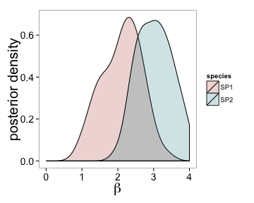

Overlapped distributions example
========================================================

This is an example of how to make overlapping, transparent distributions using ``ggplot2``. The data is fake, and just simulated within the code.

Geoms and other ``ggplot2`` commands used
---------------------------
* ``geom_density`` (``color`` by category)
* ``scale_fill_manual`` 
* ``scale_fill_hue`` 
* ``theme()`` options

Libraries required
---------------------------
* ``ggplot2``
* ``plyr``
* ``grid``
* ``ggthemes``
* ``RCurl``

Plot produced
------------------------------------------


```
## Warning: Removed 1 rows containing non-finite values (stat_density).
```

 

