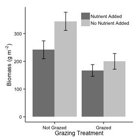

Grouped Barplot example
========================================================

This is an example of how to make a grouped barplot with error bars using ``ggplot2``. The data is fake.

The data contains measurements of biomass from a factorial experiment with nutrient (added/not added) and grazing (excluded/not excluded) treatments.

Geoms and other ``ggplot2`` commands used
---------------------------
* ``geom_bar`` (``color`` by category)
* ``geom_errorbar`` (``color`` by category)
* ``scale_x_discrete``
* ``scale_fill_grey``
* ``theme_classic()``
* ``ddply`` from the ``plyr`` package

Libraries required
---------------------------
* ``ggplot2``
* ``plyr``
* ``grid``
* ``ggthemes``
* ``RCurl``

Plot produced
------------------------------------------

 

