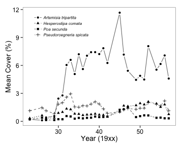

Time series and ``plyr`` example
========================================================

This is an example of how to make a time series plot using ``ggplot2`` with data processed using ``plyr``. The plot semi-reproduces Figure 1 in Adler et al. 2009, _Ecology_ (http://www.esajournals.org/doi/full/10.1890/08-2241.1). The data is freely available on _Ecological Archives_ (http://esapubs.org/archive/ecol/E091/243/default.htm).

There are two versions of this example: 1) a 'Harder' example using the raw dataset with lots of ``plyr`` usage, and 2) an 'Easier' example using a cleaned-up version of the dataset with more limited use of ``plyr``. Both versions produce the same plot via the same ``ggplot2`` commands.

Geoms and other ``ggplot2`` commands used
---------------------------
* ``geom_point`` (``shape`` by category)
* ``geom_line`` (``linetype`` by category)
* ``theme()``

Libraries required
---------------------------
* ``ggplot2``
* ``grid``
* ``plyr``
* ``RCurl``

Plot produced
------------------------------------------

 

