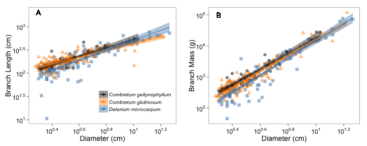

X-Y Scatterplot (Allometry) example
========================================================

This is an example of how to make a x-y scatterplot plot with linear model trend lines using ``ggplot2``. The plot semi-reproduces Figure 1 in Tredennick et al. 2013, _PLoS One_ (http://www.plosone.org/article/info%3Adoi%2F10.1371%2Fjournal.pone.0058241). The data is freely available on _Dryad_ (http://datadryad.org/resource/doi:10.5061/dryad.4s1d2).

The data contains measurements of biomass (total, stem, and leaf), length, and diameter for individual branches from savanna trees. Each observation is a branch, coded by species and tree. Here we'll just plot each observation by species and include a linear model fit for each species. We'll do two plots (diameter vs. length and diameter vs. total mass) and put them side-by-side for a publication-ready figure.

Geoms and other ``ggplot2`` commands used
---------------------------
* ``geom_point`` (``shape`` and ``color`` by category)
* ``geom_text``
* ``stat_line`` (``color`` by category)
* ``scale_colour_manual``
* ``scale_fill_manual``
* ``scale_y_log10`` and ``scale_x_log10``
* ``theme()``
* ``grid.arrange`` from the ``gridExtra``

Libraries required
---------------------------
* ``ggplot2``
* ``grid``
* ``gridExtra``
* ``ggthemes``
* ``RCurl``
* ``scales``

Plot produced
------------------------------------------

 

